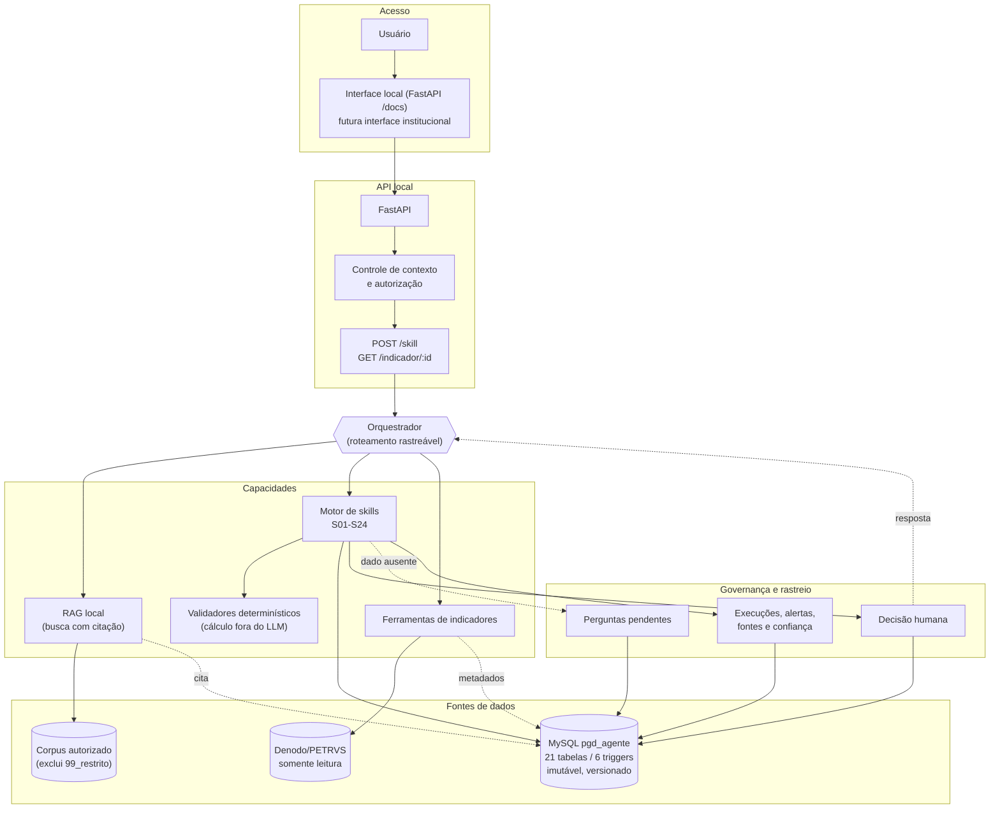

# Proposta de Projeto v6 — Agente PGD/ICMBio

**Projeto:** `pgd-agente-icmbio`  
**Versão:** 6.0  
**Data-base:** 23 de agosto de 2026  
**Situação:** documento de planejamento vigente  
**Responsável pelo protótipo:** Coordenador de Governança do ICMBio, atuando como desenvolvedor individual  
**Incremento atual:** I0 — Fundação  

> [!IMPORTANT]
> Esta proposta e seus capítulos vinculantes substituem integralmente as propostas v1 a
> v5. Elas não são necessárias para compreender, desenvolver, testar ou operar o projeto.
> Decisões humanas, aprovações de fontes e atas reais continuam fora da autoridade deste
> documento e devem permanecer pendentes até manifestação competente.

## 1. Como usar este documento

Esta é a porta de entrada normativa do projeto. Ela explica o produto, a arquitetura, o
catálogo S01–S24, o cronograma e os controles essenciais. Detalhes de implementação e
operação estão no [portal da v6](README.md).

| Perfil | Comece por | Depois consulte |
| --- | --- | --- |
| Gestor ou patrocinador | Seções 2, 3, 6 e 11 | [Visão e governança](01-visao-produto-governanca.md) |
| Analista de negócio | Seções 4, 8 e 12 | [Catálogo S01–S24](03-catalogo-skills-s01-s24.md) |
| Desenvolvedor | Seções 7, 9 e 13 | [Arquitetura](02-arquitetura-tecnologia-dados.md) e [qualidade](05-qualidade-testes-aceite.md) |
| Pessoa nova no projeto | Seções 1 a 5 | [Operação e capacitação](07-operacao-capacitacao.md) |
| Auditor ou encarregado de dados | Seções 10, 13 e 14 | [Segurança, privacidade e fontes](06-seguranca-privacidade-fontes.md) |

### 1.1. Hierarquia e precedência

1. Atos normativos vigentes.
2. Decisões de arquitetura registradas em ADR.
3. Esta proposta.
4. Capítulos vinculantes de `docs/projeto-v6/`.
5. Especificações de `skills/specs/`.
6. Anexos técnicos aprovados.
7. Registros ativos de fontes, riscos, validações, testes e atas.
8. Artefatos metodológicos anteriores da pasta `skills/`.

Em caso de conflito, norma prevalece sobre regra institucional; regra institucional sobre
recomendação; e recomendação sobre exemplo. O conflito é registrado em
`regras_conflitos`: RAG ou LLM nunca decide silenciosamente qual regra aplicar.

## 2. Sumário executivo

O projeto constrói um agente de IA para apoiar gestores e participantes do Programa de
Gestão e Desempenho no ICMBio. O produto combina três capacidades:

1. **Conhecimento com fonte:** responde questões metodológicas e institucionais usando
   recuperação de documentos (RAG), sempre com citação.
2. **Indicadores com dados reais:** consulta os 12 indicadores OCDE/PGD no Denodo por
   ferramenta controlada; o modelo não estima números.
3. **Regras executáveis:** aplica 24 skills estruturadas ao ciclo completo de planejamento,
   pactuação, execução, avaliação e aprendizagem do PGD.

A v6 adapta o projeto à realidade de um desenvolvedor individual com 12 horas semanais e
custo incremental zero. O protótipo será **local-first**: MySQL, API, RAG e dados
institucionais comuns ficam no computador autorizado. Serviços externos gratuitos são
opcionais e recebem somente conteúdo público ou sintético.

O catálogo S01–S24 será entregue em cinco ondas durante 104 semanas, de setembro de 2026
a agosto de 2028. Um protótipo técnico será obtido nas primeiras oito semanas; cada onda
posterior termina com um conjunto integrado e testável de capacidades.

## 3. Contexto, problema e público

O PGD organiza o trabalho por resultados e exige coerência entre competências da unidade,
entregas, metas, capacidade, contribuições individuais, evidências e avaliação. Hoje,
essas decisões dependem de normas distribuídas, orientações, dados do Petrvs, planilhas e
interpretações humanas. O agente deve reduzir esforço e inconsistência sem substituir a
autoridade administrativa.

### 3.1. Usuários

| Público | Necessidade | Limite do agente |
| --- | --- | --- |
| Chefia da unidade | Elaborar, monitorar e avaliar planos | A chefia confirma toda pactuação ou avaliação |
| Participante | Pactuar trabalho, registrar execução e evidências | O agente não avalia comportamento ou desempenho funcional |
| Analista de negócio | Formalizar regras e validar saídas | O agente não aprova norma ou regra institucional |
| Coordenação de governança | Acompanhar riscos, padrões e conformidade | Relatórios não podem expor ranking individual |
| Desenvolvedor | Implementar contratos, integrações e testes | Código não resolve lacuna negocial por suposição |

### 3.2. Três estágios de uso

| Estágio | Usuários | Dados | Compromisso |
| --- | --- | --- | --- |
| Protótipo individual | Desenvolvedor responsável | Públicos, sintéticos e institucionais permitidos | Sem SLA ou publicação institucional |
| Piloto controlado | CGOV e COCAGE, após autorização | Mínimos e pseudonimizados | Suporte e avaliação delimitados |
| Solução institucional | A definir pelo ICMBio | Conforme governança institucional | Exige identidade, licença, segurança, suporte e aprovação próprios |

## 4. Objetivos e resultados

### 4.1. Objetivo geral

Disponibilizar um agente rastreável que apoie a elaboração, execução e avaliação dos
Planos de Entregas e de Trabalho do PGD/ICMBio, integrando conhecimento institucional,
indicadores e regras negociais estruturadas, sem substituir decisões humanas.

### 4.2. Resultados-chave

| ID | Resultado | Evidência de alcance |
| --- | --- | --- |
| RK01 | Respostas metodológicas citam fonte válida | bateria de perguntas com precisão de citação registrada |
| RK02 | Indicadores nunca são inventados pelo modelo | consulta por ferramenta e comparação com base oficial |
| RK03 | S01–S24 usam contratos e rastreabilidade comuns | registros de execução e testes de contrato |
| RK04 | Cálculos objetivos são determinísticos | 100% de acerto nas baterias de cálculo |
| RK05 | Histórico de objetos e decisões é preservado | teste de versão, imutabilidade e recuperação |
| RK06 | Dado ausente gera pergunta pendente | casos negativos sem preenchimento silencioso |
| RK07 | Conteúdo restrito não sai do ambiente autorizado | auditoria de fluxos e classificação |
| RK08 | Protótipo individual funciona sem custo incremental obrigatório | inventário de dependências e execução local |
| RK09 | Cada onda entrega valor integrado | gate da onda e demonstração ponta a ponta |
| RK10 | Adoção institucional é separada do protótipo | decisão e checklist próprios antes de publicação |

## 5. Escopo

### 5.1. Dentro do escopo

| Item | Entrada | Saída | Dependência | Estado |
| --- | --- | --- | --- | --- |
| RAG metodológico e institucional | corpus autorizado | resposta com citação | Q5 e indexação | Planejado |
| 12 indicadores OCDE/PGD | Denodo/Petrvs | valor e contexto | rota e consulta validada | Parcialmente disponível |
| Skills S01–S24 | dados estruturados e regras | saída rastreável | ondas 1–5 | Planejado |
| Modelo comum | entidades do PGD | histórico versionado | MySQL e serviços de versão | Fundação parcial |
| API local | solicitações estruturadas | contratos JSON | FastAPI e Pydantic | Planejado |
| Interface local | usuário individual | documentação e execução assistida | API local | Planejado |
| Piloto CGOV/COCAGE | casos autorizados | métricas e feedback | conclusão dos gates | Futuro |

### 5.2. Fora do protótipo

- escrever no PETRVS ou no Denodo;
- tomar decisão administrativa automática;
- resolver conflito normativo por LLM;
- enviar conteúdo pessoal, sensível ou restrito a serviço externo;
- usar plano individual de ferramenta como backend institucional;
- garantir atendimento 24×7 ou suporte institucional;
- substituir avaliação de desempenho funcional;
- publicar o agente para todo o ICMBio sem nova decisão;
- tratar a migração `002` como aplicada antes de sua execução verificada.

## 6. Princípios e regras de ouro

1. Todo objeto tem UUID persistente e código legível.
2. Alteração gera nova versão; a anterior não é sobrescrita.
3. Toda saída automática registra origem, regra e confiança quando aplicável.
4. Decisões humanas são registradas separadamente.
5. Dado ausente vira pergunta pendente.
6. Cálculo determinístico não é delegado ao LLM.
7. Fonte, regra e vigência são separadas do texto gerado.
8. Denodo é somente leitura.
9. Dados pessoais são minimizados e resultados coletivos são agregados.
10. Uma skill só fica pronta após especificação, regras, exemplos, testes,
    implementação, integração e aceite.

## 7. Arquitetura resumida

Leitura textual: a pessoa usuária acessa a interface local, que chama a API; a API aplica
controle de contexto e autorização antes de repassar ao orquestrador, responsável por
escolher entre conhecimento (RAG), skill (motor S01–S24 com validadores determinísticos) ou
indicador (ferramentas sobre o Denodo). O RAG só recupera do corpus autorizado; o motor de
skills grava entidades, alertas, perguntas pendentes e decisões humanas no MySQL, sempre de
forma versionada e imutável; indicadores vêm do Denodo, que é somente leitura; e cálculo
nunca é delegado ao LLM. Decisões que exigem autoridade humana interrompem o fluxo até
confirmação, que também é registrada.

### 7.1. Estado atual e estado-alvo

| Elemento | Atual | Alvo | Condição |
| --- | --- | --- | --- |
| Banco | 21 tabelas, 6 triggers, migração `001` | 33 tabelas, 14 triggers | migração `002` revisada e aplicada futuramente |
| Referências Denodo | 816 unidades e 19 usuários piloto | sincronização controlada | acesso e minimização mantidos |
| Serviço de versões | operacional para o núcleo atual | cobrir entidades futuras | evolução por migração e testes |
| Motor de skills | não implementado | S01–S24 | cronograma por ondas |
| API | não implementada | `/skill` e `/indicador/{id}` | fundação técnica |
| RAG | não implementado | local, citável e governado | Q5 e pipeline seguro |
| Interface Microsoft | experimental | canal institucional opcional | licença e autorização futuras |

Detalhes: [arquitetura, tecnologia e dados](02-arquitetura-tecnologia-dados.md).

## 8. Catálogo S01–S24

| Onda | Skills | Resultado integrado |
| --- | --- | --- |
| 1 — Fundamentos | S01, S02, S03, S05, S09, S17 | fontes, regras, competências, critérios, estratégia e evidências |
| 2 — Entregas | S04, S06, S07, S08, S10, S20 | catálogo, portfólio, capacidade, cobertura, riscos e integração |
| 3 — Trabalho | S11, S12, S13, S14 | pactuação, acompanhamento e replanejamento |
| 4 — Inteligência | S15, S16, S18, S19 | interunidades, avaliação, relatório e aprendizagem |
| 5 — Execução e avaliação | S21, S22, S23, S24 | ciclo completo de PE e PT |

O catálogo completo, os nomes canônicos e as dependências estão em
[Catálogo S01–S24](03-catalogo-skills-s01-s24.md). As fichas operacionais
ficam em [`skills/specs/`](../../skills/specs/README.md).

## 9. Interfaces planejadas

Esta proposta documenta contratos futuros; não afirma que já estejam implementados.

### 9.1. `POST /skill`

Entrada mínima: `skill_id`, `versao_contrato`, `dados` e contexto autorizado. Saída:
identificador da execução, resultado estruturado, alertas, fontes, regras, confiança,
perguntas pendentes, decisões humanas requeridas, entidades relacionadas e erros.

### 9.2. `GET /indicador/{id}`

Consulta um indicador por ferramenta determinística. A resposta informa período, filtros,
fonte, horário da consulta e eventuais limitações. O LLM não calcula o indicador.

### 9.3. Estados de execução

`recebida`, `validando`, `aguardando_dados`, `aguardando_decisao`, `concluida` e `erro`.
O vocabulário será confirmado nos contratos Pydantic durante a implementação.

## 10. Segurança, privacidade e fontes

| Classe | Processamento local | Serviço externo |
| --- | --- | --- |
| Público | Permitido | Permitido sob condições vigentes |
| Institucional comum | Permitido | Não no protótipo |
| Pessoal | Restrito e minimizado | Proibido |
| Sensível | Apenas categoria/impacto necessário | Proibido |
| Sigiloso ou `99_restrito` | Segregado | Proibido |

Q5 permanece pendente. Uma fonte só é promovida ao S01 após conferência, validação humana,
ata e atualização do índice. Consulte [Segurança, privacidade e fontes](06-seguranca-privacidade-fontes.md).

## 11. Cronograma-base

Premissas: 12 horas brutas semanais, 8–9 horas efetivas, ciclos de duas semanas, no
máximo duas skills em andamento e revisão bimestral.

| Etapa | Semanas | Referência | Skills ou resultado |
| --- | ---: | --- | --- |
| Fundação | 1–8 | set.–out./2026 | motor mínimo, contratos, API e teste ponta a ponta |
| Onda 1 | 9–24 | nov./2026–fev./2027 | S01, S02, S03, S05, S09, S17 |
| Onda 2 | 25–42 | mar.–jun./2027 | S04, S06, S07, S08, S10, S20 |
| Onda 3 | 43–58 | jul.–out./2027 | S11, S12, S13, S14 |
| Onda 4 | 59–76 | nov./2027–fev./2028 | S15, S16, S18, S19 |
| Onda 5 | 77–92 | mar.–jun./2028 | S21, S22, S23, S24 |
| Estabilização | 93–104 | jun.–ago./2028 | regressão S01–S24 e piloto integrado |

Com 8 horas semanais, a previsão é 30–34 meses; com 20 horas, 15–17 meses. O detalhamento
por ciclo está em [Cronograma, capacidade e marcos](04-cronograma-capacidade-marcos.md).

## 12. Governança e responsabilidades

No protótipo, uma pessoa acumula os papéis de produto, análise, arquitetura,
desenvolvimento e teste, mas cada papel continua separado na documentação para impedir
autoaprovação indevida.

| Atividade | Desenvolvedor individual | Analistas/CGGE | Autoridade competente | TI institucional |
| --- | --- | --- | --- | --- |
| Planejamento e código | Responsável | Consultado | Informado | Consultado |
| Regras e exemplos | Executor provisório | Responsável futuro | Aprova quando cabível | Informado |
| Fonte institucional | Prepara | Valida conteúdo | Aprova Q5 | Apoia acesso |
| Arquitetura local | Responsável | Consultado | Informado | Consultado |
| Adoção institucional | Consultado | Consultado | Responsável | Responsável técnico |

Ritos: acompanhamento quinzenal, revisão de capacidade bimestral, gate ao final de cada
onda e registro formal de qualquer decisão que altere arquitetura, fonte ou regra.

## 13. Qualidade e definição de pronto

Uma skill percorre sete passos: especificação, formalização de regras, exemplos anotados,
casos de teste, implementação, integração e aceite. Só fica `aprovada` quando todos os
passos, a revisão de privacidade e a documentação operacional estiverem registrados.

Testes abrangem unidade, contrato, integração, regressão, persistência, imutabilidade,
segurança, LGPD, RAG, Denodo, ambiguidade, conflito normativo, autorização, backup e
desempenho local. Consulte [Qualidade, testes e aceite](05-qualidade-testes-aceite.md).

## 14. Riscos, decisões e questões

O registro ativo é [`docs/gestao/riscos.md`](../gestao/riscos.md). Os riscos centrais
são alucinação, exposição de dados, conflito normativo, perda de histórico, indisponibilidade
local, sobrecarga individual, expansão de escopo e dependência de validação humana.

ADRs 001–006 registram decisões anteriores. O ADR-007 formaliza o bloco execução/avaliação;
o ADR-008 formaliza a estratégia individual, local-first e S01–S24 em ondas.

Questões abertas nunca são preenchidas como fatos. Q5, validação do modelo comum, datas e
regras institucionais sem fonte continuam visíveis no
[registro de rastreabilidade](08-rastreabilidade-decisoes-riscos.md).

## 15. Estado do projeto

**I0 — Fundação, em andamento.** Concluídos: MySQL 8.4.9, migração `001`, 21 tabelas,
6 triggers, serviço de versões, teste de imutabilidade, backup diário, espelhos Denodo e
ADRs 001–006. Pendentes: Q5, validação humana do glossário/modelo, ata real, ADR-007,
ADR-008 e preparação da fundação do agente.

O próximo incremento técnico é I1: consulta metodológica inicial, primeiro indicador por
ferramenta e API local. O avanço não transforma automaticamente o protótipo em serviço
institucional.

## 16. Gates e marcos

| Gate | Condição mínima |
| --- | --- |
| G0 — Fundação | ambiente reproduzível, contratos comuns e fluxo técnico mínimo |
| G1 — Fontes | regras rastreáveis, Q5 tratada sem aprovação fictícia e S01/S02 validadas |
| G2 — Entregas | cálculos exatos, versões preservadas e conformidade rastreável |
| G3 — Trabalho | pactuação e replanejamento sem sobrescrever histórico |
| G4 — Inteligência | inferências sustentadas, amostra adequada e limites explícitos |
| G5 — Avaliação | fatos, regra, sugestão e decisão humana claramente separados |
| G6 — Piloto | regressão completa, privacidade aprovada e uso controlado autorizado |

## 17. Próximas ações

1. Concluir a Trilha N do I0 e manter Q5 pendente até ata real.
2. Revisar e aprovar ADR-007 e ADR-008.
3. Implementar a fundação técnica de oito semanas.
4. Especificar S01 e S02 usando as fichas v6.
5. Criar conjuntos sintéticos e testes de contrato.
6. Replanejar a cada oito semanas com horas reais.

## 18. Capítulos e anexos vinculantes

| Documento | Conteúdo |
| --- | --- |
| [Portal v6](README.md) | navegação e precedência |
| [01 — Visão e governança](01-visao-produto-governanca.md) | produto, escopo, EAP e RACI |
| [02 — Arquitetura](02-arquitetura-tecnologia-dados.md) | tecnologia, dados e integrações |
| [03 — Catálogo](03-catalogo-skills-s01-s24.md) | S01–S24 e dependências |
| [04 — Cronograma](04-cronograma-capacidade-marcos.md) | 104 semanas e capacidade |
| [05 — Qualidade](05-qualidade-testes-aceite.md) | testes, métricas e aceite |
| [06 — Segurança](06-seguranca-privacidade-fontes.md) | LGPD, fontes e serviços externos |
| [07 — Operação](07-operacao-capacitacao.md) | tutoriais e runbooks |
| [08 — Rastreabilidade](08-rastreabilidade-decisoes-riscos.md) | decisões, riscos e pendências |
| [09 — Evolução](09-memoria-evolucao.md) | memória v1→v6 |
| [AT-01](../tecnologia/AT-01_analise-petrvs-esquema-mysql_v1.md) | esquema PETRVS/MySQL |
| AT-02 | análise de recursos e arquitetura local-first, incorporada nesta revisão |

## 19. Glossário mínimo

| Termo | Significado |
| --- | --- |
| ADR | registro de uma decisão de arquitetura e suas consequências |
| API | interface usada por sistemas para trocar solicitações e respostas |
| CHD | carga horária disponível |
| Gate | ponto de controle que impede avançar sem critérios mínimos |
| LLM | modelo de linguagem; apoia texto e classificação, não cálculos objetivos |
| PE | Plano de Entregas da unidade |
| PGD | Programa de Gestão e Desempenho |
| PT | Plano de Trabalho do participante |
| RAG | busca trechos em fontes autorizadas antes de redigir uma resposta |
| Skill | capacidade executável com entradas, regras, saídas e testes definidos |
| Tool calling | chamada controlada a uma função ou fonte de dados |

Glossários completos: [técnico](../gestao/glossario-tecnico.md) e
[institucional](../gestao/glossario-institucional.md).

## 20. Critério de vigência

Esta proposta entra em vigor no repositório quando seus capítulos, fichas, ADRs e índices
estiverem presentes e a auditoria documental não encontrar dependência ativa das propostas
anteriores. Alterações futuras devem atualizar a proposta, o capítulo afetado, o registro
de decisões/riscos e o estado operacional do projeto.
