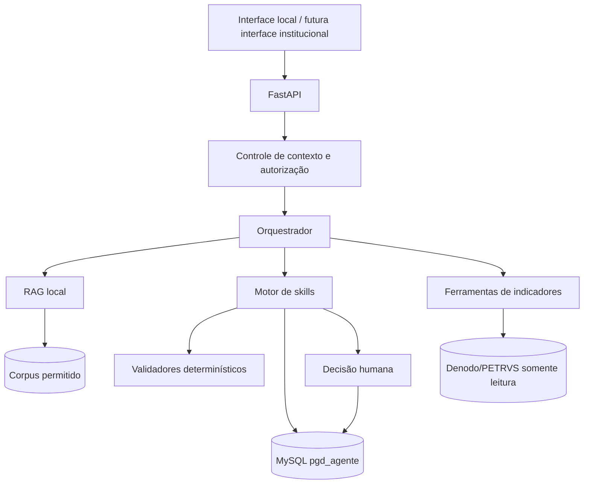

# 02 — Arquitetura, tecnologia e dados

## 1. Visão não técnica

O agente recebe uma pergunta, identifica se precisa consultar documentos, executar uma
regra ou buscar um indicador e devolve uma resposta rastreável. O modelo de linguagem
ajuda a interpretar e redigir; Python realiza cálculos; MySQL preserva versões; Denodo
fornece dados somente para leitura; e pessoas confirmam decisões.

## 2. Princípios arquiteturais

- local-first durante o protótipo;
- custo incremental obrigatório igual a zero;
- contratos explícitos entre componentes;
- menor quantidade de dados possível;
- escrita versionada apenas por serviços autorizados;
- cálculos determinísticos fora do LLM;
- fontes e regras citáveis;
- degradação segura quando uma integração falhar;
- separação entre estado atual e estado-alvo.

## 3. Componentes

| Componente | Função | Tecnologia/local | Dados | Atual | Alvo | Alternativa/risco |
| --- | --- | --- | --- | --- | --- | --- |
| Interface local | uso e demonstração | FastAPI `/docs` | solicitações | Não criada | operacional | Power Apps apenas experimental |
| API | contratos de acesso | FastAPI | JSON | Não criada | `/skill`, `/indicador/{id}` | execução direta em testes |
| Orquestrador | escolher capacidade | Python | contexto mínimo | Não criado | roteamento rastreável | fluxo explícito por endpoint |
| Motor de skills | executar S01–S24 | Python/Pydantic | entidades PGD | Não criado | catálogo versionado | implementação incremental |
| Validadores | cálculos e invariantes | Python puro | números/datas | Parcial | biblioteca comum | falha se delegado ao LLM |
| RAG | recuperar fontes | local | corpus autorizado | Não criado | busca com citação | resposta sem fonte é recusada |
| Banco | persistência | MySQL 8.4.9 local | modelo comum | 21/6 | 33/14 | backup e reconstrução |
| Versões | IDs e histórico | `src/dados/versoes.py` | entidades | Operacional parcial | cobertura ampliada | nunca inserir manualmente |
| Denodo | dados PETRVS | JDBC, leitura | indicadores/ref. | Rota validada | consultas e conciliação | CSV oficial/sintético em teste |
| Backup | recuperação | tarefa Windows | dump MySQL | Diário 19h | manter/testar | restauração manual documentada |
| Observabilidade | auditoria | logs + banco | metadados | Parcial | correlação por execução | não registrar conteúdo sensível |

## 4. Diagrama de componentes

## 5. Fluxos de dados

### 5.1. Fonte para regra

`documento → classificação → fonte institucional → versão/vigência → regra extraída →
validação humana → uso pela skill`.

Se houver conflito, a regra fica associada a `regras_conflitos`; o usuário recebe o
alerta e a questão pendente.

### 5.2. Execução de skill

`requisição → validação do contrato → leitura de entidades/fontes → cálculo ou
classificação → alertas/perguntas → decisão humana quando exigida → persistência do
rastreio → resposta`.

### 5.3. Indicador

`ID do indicador → validação dos filtros → consulta VQL autorizada → cálculo Python →
metadados da fonte → resposta`. Não há geração de valor pelo LLM.

### 5.4. Versão de entidade

`objeto existente → leitura da versão atual → proposta de alteração → decisão humana →
nova versão → atualização do ponteiro`. A versão anterior permanece imutável.

### 5.5. Execução e avaliação

`PE/PT pactuado → registro de execução → evidências → validações → avaliação proposta →
decisão da chefia → notificação/recurso quando aplicável → nova versão`.

## 6. Modelo comum

### 6.1. Grupos atuais

| Grupo | Tabelas principais | Finalidade |
| --- | --- | --- |
| Controle | `schema_migracoes` | saber o esquema aplicado |
| Governança | `execucoes_skill`, `decisoes_humanas`, `perguntas_pendentes` | rastreabilidade e autoridade |
| Referências | `ref_unidades`, `ref_usuarios` | espelho mínimo do Denodo |
| Institucional | fontes, regras, versões, conflitos | proveniência e vigência |
| Portfólio | candidatas, entregas e versões | catálogo e histórico |
| Capacidade | planos, participantes, indisponibilidades, alocações | cálculo e cobertura |
| Estratégia/risco | objetivos, resultados, vínculos e riscos | encadeamento e restrições |

### 6.2. Regras de persistência

- PK `CHAR(36)` com UUID.
- Código legível para comunicação humana.
- `created_at`, `updated_at` e `deleted_at` conforme o tipo de entidade.
- Versões são INSERT-only.
- Escrita versionável somente por `src/dados/versoes.py`.
- Funções recebem conexão e não fazem `commit`; o chamador controla a transação.
- Testes de escrita usam rollback.

### 6.3. Estado-alvo da migração `002`

A migração acrescentará o bloco de execução, evidência, avaliação, recurso e
desenvolvimento. Ela continua **planejada e não aplicada**. A aceitação futura exige
revisão do SQL, backup, teste de restauração, contagem 33/14, imutabilidade e smoke test
com rollback.

## 7. Contrato comum planejado

### Entrada

| Campo | Obrigatório | Regra |
| --- | :---: | --- |
| `skill_id` | Sim | S01–S24 existente |
| `versao_contrato` | Sim | versão suportada |
| `dados` | Sim | validado pelo contrato da skill |
| `contexto` | Não | somente dados autorizados e necessários |
| `entidades_relacionadas` | Não | IDs persistentes, nunca cópias arbitrárias |

### Saída

| Campo | Função |
| --- | --- |
| `execucao_id` | correlacionar logs e persistência |
| `skill_id`/`versao` | reproduzir comportamento |
| `status` | indicar conclusão, espera ou erro |
| `resultado` | saída tipada da skill |
| `alertas` | inconsistências e limitações |
| `regras_aplicadas` | códigos, versões e justificativas |
| `fontes` | proveniência e trechos citados |
| `confianca` | apenas quando houver inferência semântica |
| `perguntas_pendentes` | dados que faltam |
| `decisoes_requeridas` | escolhas reservadas a pessoas |
| `entidades_relacionadas` | IDs do modelo comum |
| `erros` | código estável e mensagem segura |

## 8. Denodo e PETRVS

- acesso JDBC somente leitura;
- prefixo `petrvs_icmbio_` em VQL;
- `deleted_at IS NULL` em todas as relações aplicáveis;
- datas com `CAST(... AS DATE)`;
- cálculos finais em Python quando VQL for limitado;
- nenhum CPF ou e-mail no espelho do piloto;
- comparação com CSV oficial para validação;
- indisponibilidade gera erro controlado, nunca estimativa.

## 9. RAG

O pipeline planejado executa inventário, classificação, extração/OCR, fragmentação,
metadados, indexação local, recuperação, citação e avaliação. Cada fragmento preserva
fonte, versão, vigência, classe de acesso e natureza. `99_restrito` é excluído por padrão.

## 10. Recursos disponíveis

| Recurso | Uso permitido no projeto | Não presumir |
| --- | --- | --- |
| Assistentes de programação (Codex, Claude Code) | desenvolvimento e revisão | créditos de API, publicação multiusuário ou serviço institucional |
| Microsoft 365 E3 | produtividade e identidade disponíveis ao usuário | todos os recursos premium do tenant |
| Power Apps Premium | experimento individual de interface | distribuição institucional automática |
| Copilot Studio Viral Trial | prova temporária | publicação governada e duradoura |
| Fabric Free | experimentos individuais | capacidade organizacional |
| Power Automate (licença gratuita) | fluxos individuais simples | automação premium institucional |

## 11. Falhas e degradação segura

| Falha | Comportamento |
| --- | --- |
| MySQL indisponível | não escrever; informar indisponibilidade e orientar recuperação |
| Denodo indisponível | não responder indicador; usar base de teste apenas em QA |
| Fonte ausente | criar pergunta pendente |
| Fonte conflitante | apresentar conflito e exigir decisão |
| Modelo externo indisponível | usar processamento local ou suspender tarefa sem perder dados |
| Contrato incompatível | rejeitar com erro de versão |
| Dado classificado incorretamente | interromper envio externo e registrar incidente |

## 12. Decisões relacionadas

- ADR-002: Denodo somente leitura.
- ADR-003: arquitetura de capacidades.
- ADR-004: modelo de linguagem substituível.
- ADR-005: stack RAG.
- ADR-006: MySQL.
- ADR-007: execução e avaliação.
- ADR-008: estratégia individual local-first e catálogo em ondas.

Detalhes do esquema: [AT-01](../tecnologia/AT-01_analise-petrvs-esquema-mysql_v1.md).
