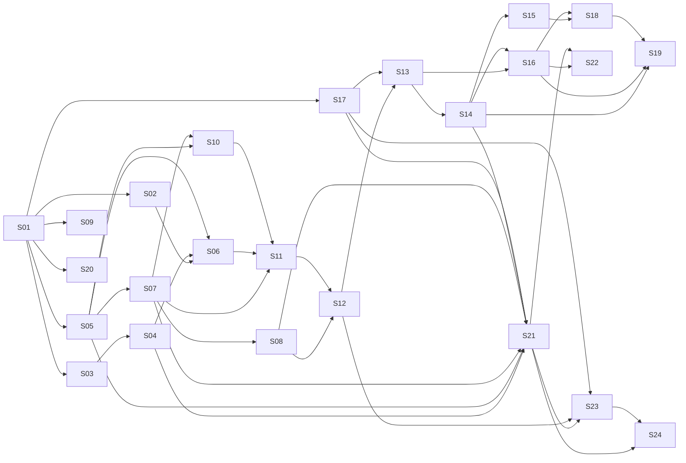

# 03 — Catálogo de skills S01–S24

## 1. Finalidade

Este é o mapa funcional e técnico do núcleo do produto. Uma skill é uma capacidade
executável com objetivo, entradas, regras, saídas, limites e testes. O catálogo não
substitui as [fichas individuais](../../skills/specs/README.md).

## 2. Cadeia de valor

```text
fontes → regras → competências → catálogo → metas → portfólio
       → capacidade → cobertura → estratégia → riscos
       → pactuação de PE/PT → monitoramento → replanejamento
       → evidências → execução → avaliação → relatório → aprendizagem
```

## 3. Catálogo funcional

| ID | Nome | Finalidade | Usuário principal | Entrada | Saída | Decisão humana |
| --- | --- | --- | --- | --- | --- | --- |
| S01 | Configurador Institucional do PGD | cadastrar contexto, fontes e parâmetros vigentes | administrador negocial | documentos e configurações | perfil institucional versionado | aprovar fonte e parâmetro |
| S02 | Verificador Normativo e de Conformidade | testar plano/regra contra fontes vigentes | analista/chefia | objeto e regras S01 | achados, conflitos e perguntas | decidir conflito/exceção |
| S03 | Extrator de Competências e Responsabilidades em Entregas | transformar competências em entregas candidatas | chefia/analista | regimento, cadeia de valor | competências e candidatas rastreáveis | confirmar interpretação |
| S04 | Administrador do Catálogo de Entregas | criar, versionar e reutilizar entregas | chefia/analista | candidatas S03 | catálogo de entregas | aprovar inclusão/versão |
| S05 | Designer de Metas, Indicadores e Critérios de Aceite | tornar entrega mensurável e verificável | chefia/equipe | entrega, período, contexto | meta, indicador e aceite | pactuar critério/meta |
| S06 | Auditor de Portfólio de Entregas | detectar lacunas, duplicidades e incoerências | chefia/analista | catálogo e competências | achados priorizados | aceitar ajuste/exceção |
| S07 | Planejador de Capacidade da Unidade | calcular CHD e demanda | chefia | pessoas, período, indisponibilidades | capacidade e cenários | escolher cenário |
| S08 | Matriz de Cobertura das Entregas pela Equipe | verificar cobertura e concentração | chefia/equipe | capacidade e entregas | matriz de cobertura | definir alocação |
| S09 | Designer e Auditor de Encadeamento OKR-D | vincular objetivos, resultados e entregas | chefia/estratégia | objetivos e entregas | vínculos justificados | confirmar alinhamento |
| S10 | Analisador de Riscos, Dependências e Restrições | estruturar riscos e respostas | chefia/equipe | entregas, capacidade, contexto | registro de riscos | aceitar resposta/risco |
| S11 | Assistente de Pactuação do Plano de Entregas | compor o PE pactuável | chefia | portfólio, metas, capacidade, riscos | minuta de PE | pactuar/aprovar PE |
| S12 | Assistente de Pactuação do Plano de Trabalho | decompor contribuições individuais | chefia/participante | PE, pessoa, capacidade | minuta de PT | pactuar PT |
| S13 | Check-in de Execução e Monitoramento | registrar acompanhamento leve | chefia/participante | PE/PT, fatos e evidências | status, alertas e pendências | confirmar registro |
| S14 | Gestor de Alterações e Replanejamento | propor nova versão de plano | chefia/participante | mudança, impacto, plano atual | proposta de versão | aprovar alteração |
| S15 | Gestor de Contribuições Interunidades | organizar contribuições entre unidades | chefias | demanda, unidade, participante | vínculo e responsabilidades | pactuar contribuição |
| S16 | Avaliador de Entregas | apoiar análise intermediária de entrega | chefia | entrega, critérios e evidências | análise fundamentada | decidir avaliação; subordinada a S22 |
| S17 | Organizador de Evidências | classificar e vincular evidências | participante/chefia | arquivos, links e registros | evidência catalogada | confirmar pertinência |
| S18 | Gerador de Relatório Gerencial do PGD | consolidar resultados sem ranking individual | governança/chefia | planos, execução e avaliações | relatório agregado | aprovar divulgação |
| S19 | Analisador de Aprendizado entre Ciclos | identificar padrões e melhorias | governança/chefia | histórico suficiente | hipóteses e recomendações | validar interpretação |
| S20 | Importador, Exportador e Integrador de Planos | trocar dados com formatos controlados | administrador/desenvolvedor | arquivo ou contrato externo | importação/relatório de divergência | confirmar conflito/mapeamento |
| S21 | Registro de Execução do Plano de Entregas da Unidade | registrar progresso e intercorrências do PE | chefia da unidade | PE, metas, execução | versão de execução do PE | confirmar fatos e ajustes |
| S22 | Avaliação do Plano de Entregas da Unidade | apoiar avaliação pela chefia superior | chefia superior | PE executado, critérios, evidências | parecer e conceito proposto | decidir conceito |
| S23 | Registro de Execução do Plano de Trabalho do Participante | registrar contribuição, CH e ocorrências | participante | PT e execução | versão de execução do PT | confirmar registro |
| S24 | Avaliação do Plano de Trabalho do Participante | apoiar avaliação, notificação e recurso | chefia da unidade | PT executado, critérios, evidências | parecer e fluxo de avaliação | decidir conceito/recurso |

## 4. Classificação técnica

| ID | Determinístico | Uso semântico permitido | Persistência principal | Integrações |
| --- | --- | --- | --- | --- |
| S01 | vigência, completude e hash | classificação de trechos | fontes/regras/versões | corpus/RAG |
| S02 | checklist e precedência conhecida | localizar regra aplicável | conflitos/perguntas/execução | S01/RAG |
| S03 | estrutura e vínculos | extrair competência/entrega | candidatas/fontes | S01 |
| S04 | ID, versão e validação estrutural | sugerir título/descrição | entregas/versões | S03 |
| S05 | fórmulas, faixa e unidade | propor redação de critérios | versões de entrega | S04 |
| S06 | duplicidade estrutural e cobertura | similaridade semântica | execuções/decisões | S02/S04/S05 |
| S07 | CHD, soma, período e cenário | explicar restrições | capacidade/participantes/alocações | ref_usuarios |
| S08 | matriz, totais e concentração | sugerir redistribuição | alocações/decisões | S07 |
| S09 | integridade dos vínculos | justificar alinhamento | OKR-D/vínculos | S01/S04 |
| S10 | matriz P×I e completude | sugerir risco/resposta | registros de risco | S05/S07 |
| S11 | completude, período e totais | redigir minuta | PE e versões futuras | S02/S06/S07/S10 |
| S12 | CHD e compatibilidade | redigir contribuição | PT e versões futuras | S07/S08/S11 |
| S13 | datas, progresso e pendências | classificar relato | acompanhamento/execução | S10/S11/S12/S17 |
| S14 | comparação de versões | resumir justificativa | nova versão/decisão | S02/S11/S13 |
| S15 | carga e vínculos | explicar contribuição | contribuições | S08/S12/S14 |
| S16 | faixa e critério | fundamentar análise | avaliação intermediária | S05/S13/S14/S17 |
| S17 | hash, tipo, tamanho e vínculo | classificar evidência | evidências | armazenamento local |
| S18 | agregações | síntese narrativa | relatório/execução | S06–S17 |
| S19 | estatística e suficiência | hipóteses de aprendizagem | análise/decisão | histórico/S18 |
| S20 | schema, tipos e reconciliação | sugerir mapeamento | execução/divergência | arquivos/PETRVS |
| S21 | progresso × meta e bloqueios | classificar ocorrência | execução PE/versões | S04/S05/S07/S08/S14/S17 |
| S22 | prazo, competência e faixa | fundamentar parecer | avaliação PE/decisão | S10/S16/S17/S21 |
| S23 | CH, soma, prazo e bloqueios | classificar ocorrência | execução PT/versões | S12/S14/S17/S21 |
| S24 | prazo, faixa e rito | fundamentar parecer | avaliação PT/recurso | S10/S12/S17/S21/S23 |

## 5. Dependências

| ID | Pré-requisitos funcionais | Consumidores principais | Gate |
| --- | --- | --- | --- |
| S01 | B01 e fontes candidatas | S02–S05, S09, S17, S20 | G1 |
| S02 | S01, base metodológica | S06, S11, S14 | G1 |
| S03 | S01 | S04 | G1 |
| S04 | S01, S03 | S06, S09, S11, S21 | G2 |
| S05 | S01 e metodologia | S06, S10, S16, S21, S22, S24 | G1/G2 |
| S06 | S02, S04, S05 | S11, S18 | G2 |
| S07 | S05, referências e calendário | S08, S10, S11, S12, S21 | G2 |
| S08 | S07 | S12, S15, S21 | G2 |
| S09 | S01 e objetivos | relatórios e auditoria | G1 |
| S10 | S05, S07 | S11, S13, S18, S22, S24 | G2 |
| S11 | S02, S06, S07, S10 | S12–S14 | G3 |
| S12 | S07, S08, S11 | S13, S15, S23, S24 | G3 |
| S13 | S10, S11, S12, S17 | S14, S16, S18 | G3 |
| S14 | S02, S11, S13 | S15, S16, S19, S21, S23 | G3 |
| S15 | S08, S12, S14 | S18 | G4 |
| S16 | S05, S13, S14, S17 | S18, S19, S22 | G4 |
| S17 | S01, S05 | S13, S16, S21–S24 | G1 |
| S18 | S06–S08, S10, S13, S15, S16 | S19 | G4 |
| S19 | S14, S16, S18 e histórico suficiente | melhoria do catálogo | G4 |
| S20 | S01, S02 e modelo comum | carga/conciliação | G2 |
| S21 | S04, S05, S07, S08, S14, S17 | S22–S24 | G5 |
| S22 | S10, S16, S17, S21 | relatório/decisão | G5 |
| S23 | S12, S14, S17, S21 | S24 | G5 |
| S24 | S10, S12, S17, S21, S23 | relatório/decisão | G5 |

## 6. Grafo



Leitura textual: S01 funda regras, competências, critérios, estratégia e evidências; S04–
S10 constroem o planejamento da unidade; S11–S14 pactuam e acompanham PE/PT; S15–S19
consolidam qualidade e aprendizagem; S21–S24 executam e avaliam.

## 7. Planejamento

| ID | Onda | Prioridade | Esforço relativo | Estado inicial | Marco |
| --- | ---: | --- | --- | --- | --- |
| S01 | 1 | P0 | alto | especificação a consolidar | M2 |
| S02 | 1 | P0 | alto | especificação a consolidar | M2 |
| S03 | 1 | P0 | médio | matriz existente | M2 |
| S05 | 1 | P0 | alto | especificação existente | M2 |
| S09 | 1 | P1 | médio | base OKR-D existente | M2 |
| S17 | 1 | P0 transversal | médio | conceito existente | M2 |
| S04 | 2 | P0 | médio | especificação existente | M3 |
| S06 | 2 | P0 | alto | especificação existente | M3 |
| S07 | 2 | P0 | alto | especificação existente | M3 |
| S08 | 2 | P0 | alto | especificação existente | M3 |
| S10 | 2 | P1 | médio | especificação existente | M3 |
| S20 | 2 | P1 | alto | matriz existente | M3 |
| S11 | 3 | P1 | alto | matriz existente | M4 |
| S12 | 3 | P1 | alto | matriz existente | M4 |
| S13 | 3 | P1 | médio | reposicionada | M4 |
| S14 | 3 | P1 | alto | matriz existente | M4 |
| S15 | 4 | P2 | médio | matriz existente | M5 |
| S16 | 4 | P1 | alto | subordinada a S22 | M5 |
| S18 | 4 | P2 | alto | matriz existente | M5 |
| S19 | 4 | P2 | alto | depende de histórico | M5 |
| S21 | 5 | P1 | alto | ficha funcional existente | M6 |
| S22 | 5 | P1 | alto | ficha funcional existente | M6 |
| S23 | 5 | P1 | alto | ficha funcional existente | M6 |
| S24 | 5 | P1 | alto | ficha funcional existente | M6 |

## 8. Regras transversais

- Uma skill referencia objetos persistentes; não recria cópias.
- Cálculos, prazos e totalizações têm 100% de exatidão nos casos definidos.
- Classificação semântica expõe confiança e permite revisão.
- Saída cita regra e fonte.
- Decisão humana não é preenchida pelo modelo.
- Dado ausente produz pergunta pendente.
- Dados de saúde não são persistidos em texto livre.
- Relatórios não criam ranking individual.
- Importação nunca sobrescreve versão vigente sem decisão.

## 9. Estados documentais

`planejada → em_especificacao → especificada → em_implementacao → implementada →
em_validacao → aprovada`.

`implementada` não significa `aprovada`. Bloqueios por fonte ou validação são registrados
sem retroceder evidências técnicas já concluídas.

## 10. Fonte operacional

Consulte [`skills/specs/README.md`](../../skills/specs/README.md). Os documentos
`skills/01` a `skills/05` continuam como insumos metodológicos e históricos, mas não
prevalecem sobre este catálogo e as fichas v6.

## 11. Regras RN-01–RN-36 de execução e avaliação

Os códigos abaixo são provisórios até carga e validação pelo S01. Fontes normativas e
institucionais devem ser confirmadas em Q5; a tabela não constitui aprovação.

| Código | Regra estruturada | Skill |
| --- | --- | --- |
| RN-01 | A chefia da unidade registra a execução do PE | S21 |
| RN-02 | O registro descreve evolução das entregas e ocorrências de impacto | S21 |
| RN-03 | O registro ocorre durante a execução e se completa ao fim da vigência | S21 |
| RN-04 | A conclusão do PE depende da verificação dos PTs do período | S21 |
| RN-05 | Ajustes do PE são comunicados à chefia superior conforme regra aplicável | S21/S14 |
| RN-06 | Ajuste do PE pode exigir repactuação dos PTs vinculados | S21/S14 |
| RN-07 | Calendário do PE é configuração institucional validada | S21 |
| RN-08 | Progresso esperado é planejamento; progresso realizado é execução | S21 |
| RN-09 | Unidade hierarquicamente superior avalia o PE em cascata | S22 |
| RN-10 | Unidade instituidora também executora pode ter dispensa normativa | S22 |
| RN-11 | Ato autorizativo pode prever outras dispensas previstas em norma | S22 |
| RN-12 | Avaliação do PE observa até 30 dias após o encerramento | S22 |
| RN-13 | Avaliar metas, prazos, justificativas e qualidade esperada | S22 |
| RN-14 | Escala 1 excepcional, 2 alto desempenho, 3 adequado, 4 inadequado, 5 não executado | S22/S24 |
| RN-15 | Norma geral não define automaticamente consequências 4/5 para PE | S22 |
| RN-16 | Resultado insatisfatório do PE analisa plano/gestão, não falha individual automática | S22 |
| RN-17 | Participante registra a execução do próprio PT | S23 |
| RN-18 | Registro contém trabalhos realizados e intercorrências justificadas | S23 |
| RN-19 | PT até 30 dias: registro em até 10 dias; maior: mensal até o décimo dia subsequente | S23 |
| RN-20 | Periodicidade mensal do PT no ICMBio depende da fonte vigente | S23 |
| RN-21 | Férias, licenças e afastamentos planejados não são intercorrências | S07/S23 |
| RN-22 | Intercorrências são fatos supervenientes com impacto, sem detalhe sensível | S23 |
| RN-23 | PT pode ser ajustado ou repactuado conforme competência e regra | S14/S23 |
| RN-24 | CHD = jornada × dias trabalháveis, ajustada por ocorrências programadas | S07/S23 |
| RN-25 | Usufruto/compensação registra categoria, horas e período de origem | S23 |
| RN-26 | PT corresponde à CHD; execução inferior não gera folga automática | S12/S23 |
| RN-27 | Chefia avalia o PT como um todo, não cada atividade | S24 |
| RN-28 | Avaliação do PT observa até 20 dias após o limite de registro | S24 |
| RN-29 | Considerar pactuação, critérios, fatores externos, TCR e ocorrências | S24 |
| RN-30 | Participante é notificado do resultado | S24 |
| RN-31 | Conceitos 1 e 5 exigem justificativa da chefia | S24 |
| RN-32 | Conceitos 4/5 admitem recurso e manifestação em prazos de 10 dias | S24 |
| RN-33 | Foco é contribuição às entregas, não comportamento | S24 |
| RN-34 | Chefia promove acompanhamento e ações de desenvolvimento | S24 |
| RN-35 | PGD não tem caráter punitivo automático | S24 |
| RN-36 | Avaliação do PGD não substitui avaliação anual de desempenho | S24 |

### 11.1. Conflitos obrigatórios

- C-01: calendário 2026 inconsistente; motor recebe configuração validada.
- C-02: conceitos de PE e PT têm efeitos distintos; avaliações ficam separadas.
- C-03: conclusão de PE depende da situação dos ciclos mensais de PT.
- A-01: faixa percentual CGOV é regra institucional, não norma.
- A-02: fator externo é separado, sem rebaixamento automático.
- A-03: contagem de etapas é evidência, não progresso automático.
